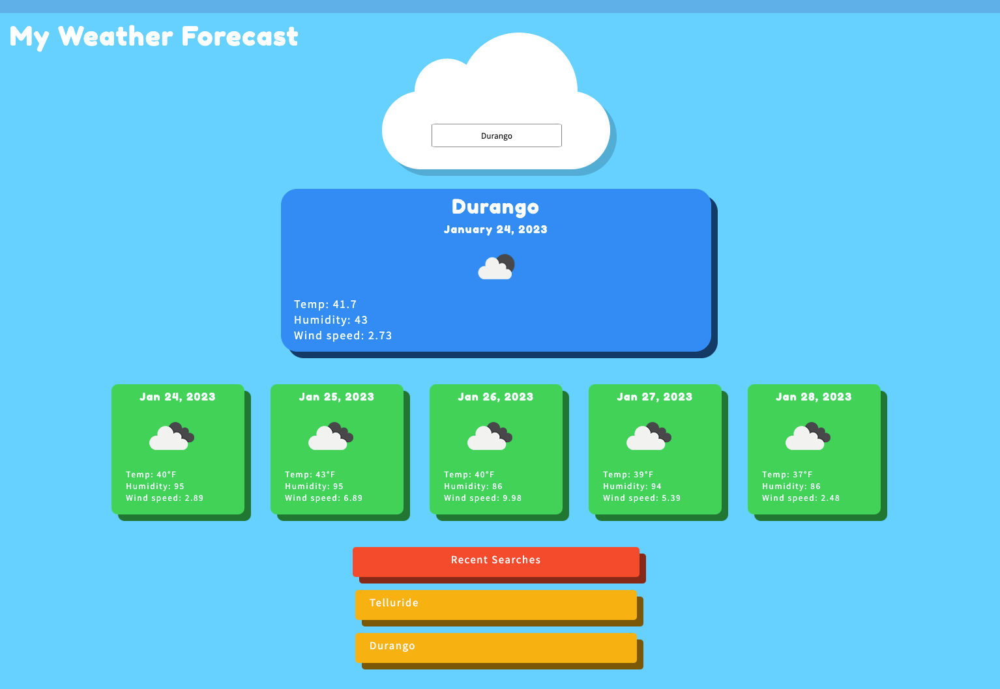

# Five Day Forecast

[Here](https://rucatues.github.io/Five-Day-Forecast-/) is the link to the website. 

## Description

This weather app makes it easy to know whether you need to pack a jacket or an umbrella before you leave the house. 

Using the Open Weather API, this app displays weather data about a city of your choosing. Enter your city name into the cloud search bar and the current weather + five day forecast will display. At the bottom, your recent searches are listed which allows you to easily switch between cities. Google Fonts, Bootstrap, and JQuery are utilized in this project. 

## Screenshot

## License 
MIT License

## Known Bugs/Future plans

When searching for >2 cities, the recent search section gets a littie funky and is duplicating results. 

Plans to make site mobile-responsive in the future. 

## Credits
CSS for the cloud was inspired by a tutorial from Fernando Castro. https://codepen.io/fershocastro/pen/dVBgxQ